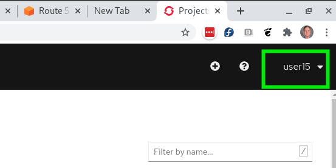
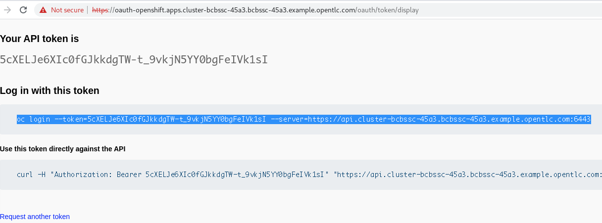
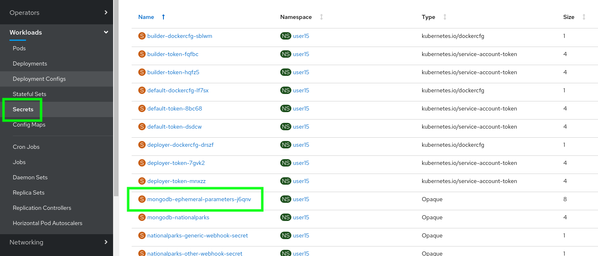

= Websphere Liberty and OpenShift Workshop

There is a very good exercise published by IBM for using OpenLiberty with OpenShift. This document seeks to provide the information so that one can run this workshop in a Red Hat Product Demo System environment.
We will start with pre-requisites for doing Maven builds on a Red Hat Enterprise Linux (RHEL) host.

The guide we will be using is from the openliberty.io site:

https://openliberty.io/guides/cloud-openshift.html

=== Logging into the Workshop

We will be using a modern, secure, in the cloud RHEL 8 instances for building images for the workshop. To access this system, login with your assigned user # as follows:

 $ ssh userxx@linux.yamlmammal.com

NOTE: Your instructor will provide the password

=== Getting the OpenLiberty bits

 $ git clone https://github.com/openliberty/guide-cloud-openshift.git
 $ cd guide-cloud-openshift

TIP: Do not use sudo on the docker commands. We will not be building as the root user of the system. We do not need root level daemons for a daemon.

=== Accessing your OpenShift Instance

Log into your OpenShift Console Instance:

http://console-openshift-console.apps.cluster-bcbssc-45a3.bcbssc-45a3.example.opentlc.com

NOTE: username: userXX password: openshift
Use the same username you used above for the Linux instance

 The API endpoint can be logged into at the following address, but we will use a token from the console:

api.cluster-bcbssc-45a3.bcbssc-c42d.example.opentlc.com:6443

Let's log into the command line on your linux.yamlmammal.com. Click on your username in the upper right of the WebGUI console:

Select "Copy Login Command"

This will provide the opportunity to get your full login string (withe embedded token) after re-authenticating

paste that right to the command line in your linux host.

=== Logging into the registry

To log into the registry use the following command

 $ oc registry login

NOTE: If an OpenShift instance is not using a signed certificate, one must use:

 $ oc registry login --insecure=true

== Part II OpenShift Getting Started for Java

We will now access a new URL in order to have access to a jupyter workbook oriented tutorial.

Log in here:

https://lab-getting-started-java-labs.apps.cluster-bcbssc-45a3.bcbssc-45a3.example.opentlc.com/

== Other tips

Here are the prerequisites if you want to set up a build server on RHEL 7. I highly recommend RHEL 8 and docker-podman as an approach instead.

Openshift API for command line 'oc' client: 

Download oc client from https://mirror.openshift.com/pub/openshift-v4/clients/ocp/4.3.33/openshift-client-linux-4.3.33.tar.gz

http://gogs-labs.apps.cluster-bcbssc-45a3.bcbssc-45a3.example.opentlc.com/[Gogs Server]

=== Resources

https://docs.openshift.com/container-platform/4.5/openshift_images/create-images.html#images-create-guide-general_create-images[Creating Images the OpenShift way]

=== Errata

==== Deploying Java Code

Deployment Config should be checked as the type of "deployment" as opposed to deployment

openjdk should be version 8

=== Adding a Database (MongoDB)

When prompted to find the secret under Parameters after deploying the database, find the secret under the "Secrets" tab in the very left column of the interface. There will be a secret names something like 

== To Be Moved
ssh userxx@linux.yamlmammal.com

=== Working with the legacy docker on RHEL 7

=== Obtaining RHEL
A free copy of RHEL can be obtained from the Red Hat Developers network at https://developers.redhat.com[Free Red Hat Developers Subscriptions]

== Setting up RHEL 7.x with the commands for the workshop

 $ sudo yum install git vim wget java-11-openjdk docker

Confirm the installation by yum and this will install the needed tools from Red Hat repositories.

Now we should enable and start the docker daemon via systemd commands:

 $ sudo systemctl enable docker
 $ sudo systemctl start docker

== Installing Maven

We will also need Maven, and this is not packaged, so we will install that from the apache repository

With thanks to a "tecadmin.net" article:
https://tecadmin.net/install-apache-maven-on-centos/[maven installation]

 $ cd ./.local
 .local] $
 .local] $ mkdir bin
 .local] $ cd bin
 bin] $ env | grep home.*\.local

The last command should reveal that your path includes /home/<username>/.local/bin

You may also just put maven in any other directory (or create one) of your choosing, as we will set the path to find it.

 bin]$ wget https://downloads.apache.org/maven/maven-3/3.6.3/binaries/apache-maven-3.6.3-bin.tar.gz

 bin]$ tar zxvf apache-maven-3.6.3-bin.tar.gz
 bin]$ ln -sf apache-maven-3.6.3 maven
 bin]$ ls
 apache-maven-3.6.3  apache-maven-3.6.3-bin.tar.gz  maven
 bin]$ rm apache-maven-3.6.3-bin.tar.gz
 bin]$

Create this file 
/etc/profile.d/maven.sh

With the following content: 

 export M2_HOME=~/.local/bin/maven
 export PATH=${M2_HOME}/bin:${PATH}

And then run the following command:

 $ source /etc/profile.d/maven.sh
 $ mvn --version

Results in:

 Apache Maven 3.6.3 (cecedd343002696d0abb50b32b541b8a6ba2883f)
 Maven home: /home/jbarlow/.local/bin/maven
 Java version: 11.0.8, vendor: N/A, runtime: /usr/lib/jvm/java-11-openjdk-11.0.8.10-0.el7_8.x86_64
 Default locale: en_US, platform encoding: UTF-8
 OS name: "linux", version: "3.10.0-1127.19.1.el7.x86_64", arch: "amd64", family: "unix"
 $

==== Get the oc (OpenShift Command)
Get the OpenShift Command (oc) at the following URL:

 $ wget https://mirror.openshift.com/pub/openshift-v4/clients/ocp/4.3.33/openshift-client-linux-4.3.33.tar.gz

 $ tar zxvf openshift-client-linux-4.3.33.tar.gz
 $ mv oc kubectl ~/.local/bin/

 https://mirror.openshift.com/pub/openshift-v4/clients/ocp/4.3.33/openshift-client-linux-4.3.33.tar.gz

Modify the Dockerfile in each project to account for the COPY command in the RHEL supplied version of Docker not having the --chown flag.

